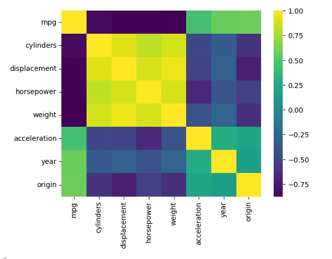
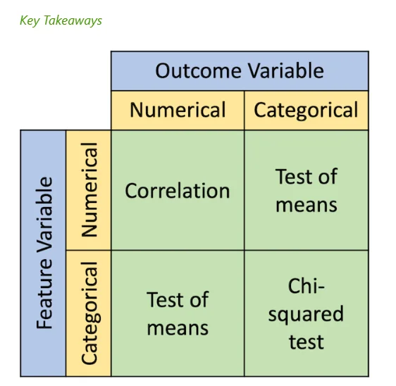

# 📘 อธิบาย Notebook: Correlation Coefficient ทีละ Cell

---

## 📌 ภาพรวม

Notebook นี้สอนเรื่อง **Correlation Coefficient** ซึ่งเป็นค่าที่วัดความสัมพันธ์ระหว่างตัวแปร 2 ตัว โดยใช้ Dataset **Auto-MPG** เป็นตัวอย่าง

---

# ส่วนที่ 1: Introduction

---

## Cell 0-1: หัวข้อและนิยาม

```markdown
# Correlation Coefficient

A measure of the linear correlation between two variables.
A coefficient has a value between +1 and −1, where 1 is total positive linear correlation, 
0 is no linear correlation, and −1 is total negative linear correlation.
```

### 📖 อธิบาย:

**Correlation Coefficient** = ค่าที่วัดความสัมพันธ์เชิงเส้นระหว่าง 2 ตัวแปร

| ค่า | ความหมาย | ตัวอย่าง |
|-----|----------|----------|
| **+1** | สัมพันธ์เชิงบวกสมบูรณ์ | x เพิ่ม → y เพิ่ม (เสมอ) |
| **0** | ไม่มีความสัมพันธ์เชิงเส้น | x กับ y ไม่เกี่ยวกัน |
| **-1** | สัมพันธ์เชิงลบสมบูรณ์ | x เพิ่ม → y ลด (เสมอ) |

---

## Cell 2-3: รูปภาพแสดงค่า Correlation ต่างๆ

### 📊 ภาพประกอบ:


### 📖 อธิบาย:

รูปแสดงตัวอย่าง Scatter Plot ที่มีค่า Correlation ต่างๆ:

| รูปแบบ | ค่า r | ลักษณะ |
|--------|-------|--------|
| จุดเรียงเป็นเส้นขึ้น | r ≈ +1 | ความสัมพันธ์เชิงบวกสูง |
| จุดเรียงเป็นเส้นลง | r ≈ -1 | ความสัมพันธ์เชิงลบสูง |
| จุดกระจายเป็นวงกลม | r ≈ 0 | ไม่มีความสัมพันธ์ |

---

# ส่วนที่ 2: Pearson Correlation

---

## Cell 4-5: แนะนำ Pearson Correlation

```markdown
#### Pearson Correlation Coefficient

The Pearson correlation coefficient measures the linear relationship between two datasets. 
Strictly speaking, Pearson's correlation requires that each dataset be normally distributed.
```

### 📖 อธิบาย:

**Pearson Correlation** คือวิธีวัดความสัมพันธ์ **เชิงเส้น** (Linear) ที่นิยมใช้มากที่สุด

| หัวข้อ | รายละเอียด |
|--------|------------|
| **ประเภท** | Parametric |
| **ข้อกำหนด** | ข้อมูลต้อง **แจกแจงปกติ** (Normal Distribution) |
| **วัดอะไร** | ความสัมพันธ์แบบ **เส้นตรง** |
| **ค่า** | -1 ถึง +1 |

⚠️ **ข้อควรจำ:** ถ้าข้อมูลไม่แจกแจงปกติ → Pearson อาจไม่เหมาะสม

---

## Cell 6-8: สูตร Pearson Correlation

```markdown
Formula:
```

### 📊 สูตร:


### 📖 อธิบายสัญลักษณ์:

| สัญลักษณ์ | ความหมาย |
|-----------|----------|
| $r$ | ค่า Correlation Coefficient |
| $x_i$ | ค่าของตัวแปร x แต่ละตัว |
| $\bar{x}$ | ค่าเฉลี่ย (mean) ของ x |
| $y_i$ | ค่าของตัวแปร y แต่ละตัว |
| $\bar{y}$ | ค่าเฉลี่ย (mean) ของ y |

### 📝 สูตรในรูปแบบข้อความ:

$$r = \frac{\sum(x_i - \bar{x})(y_i - \bar{y})}{\sqrt{\sum(x_i - \bar{x})^2 \sum(y_i - \bar{y})^2}}$$

---

# ส่วนที่ 3: Dataset (Auto-MPG)

---

## Cell 9-11: แนะนำ Dataset

```markdown
#### The 'auto-mpg' Dataset

In this lesson, we will use the 'auto-mpg' dataset, which was taken from the StatLib library 
maintained at Carnegie Mellon University. This dataset was used in the 1983 American Statistical 
Association Exposition and contains 398 automobile records from 1970 to 1982.
```

### 📖 อธิบาย:

**Auto-MPG Dataset** = ข้อมูลรถยนต์ 398 คัน (ปี 1970-1982)

| Attribute | คำอธิบาย | ประเภท |
|-----------|----------|--------|
| **mpg** ⭐ | ระยะทางต่อแกลลอน (Target) | Numerical |
| cylinders | จำนวนสูบ (4-8) | Numerical |
| displacement | ความจุเครื่องยนต์ (ลูกบาศก์นิ้ว) | Numerical |
| horsepower | แรงม้า | Numerical |
| weight | น้ำหนักรถ (ปอนด์) | Numerical |
| acceleration | เวลาเร่ง 0-60 mph (วินาที) | Numerical |
| model year | ปีรุ่น | Numerical |
| origin | 1=US, 2=EU, 3=JP | Categorical |
| model | ชื่อรุ่นรถ | Text |

⭐ **mpg** คือ Target Variable (ตัวแปรที่เราต้องการทำนาย)

---

## Cell 12: Import Libraries

```python
import pandas as pd
import numpy as np
import matplotlib.pyplot as plt
import seaborn as sns
from scipy import stats
```

### 📖 อธิบาย:

| Library | ใช้ทำอะไร |
|---------|----------|
| `pandas` | จัดการข้อมูลตาราง (DataFrame) |
| `numpy` | คำนวณตัวเลข, array |
| `matplotlib.pyplot` | สร้างกราฟพื้นฐาน |
| `seaborn` | สร้างกราฟสถิติสวยๆ |
| `scipy.stats` | ฟังก์ชันทางสถิติ (correlation, test) |

---

## Cell 13-14: Read Dataset

```python
df = pd.read_csv("https://raw.githubusercontent.com/ThammakornS/ProgStat/main/dataset/auto-mpg.csv")
df.head()
```

### 📖 อธิบาย:

| คำสั่ง | ความหมาย |
|--------|----------|
| `pd.read_csv(url)` | โหลดข้อมูลจากไฟล์ CSV |
| `df.head()` | แสดง 5 แถวแรกของข้อมูล |

### 📊 ผลลัพธ์ (ตัวอย่าง):

| mpg | cylinders | displacement | horsepower | weight | acceleration | year | origin | model |
|-----|-----------|--------------|------------|--------|--------------|------|--------|-------|
| 18.0 | 8 | 307.0 | 130.0 | 3504 | 12.0 | 70 | 1 | chevrolet chevelle malibu |
| 15.0 | 8 | 350.0 | 165.0 | 3693 | 11.5 | 70 | 1 | buick skylark 320 |
| 18.0 | 8 | 318.0 | 150.0 | 3436 | 11.0 | 70 | 1 | plymouth satellite |

---

## Cell 15: Data Info

```python
df.info()
```

### 📖 อธิบาย:

แสดงข้อมูลโครงสร้างของ DataFrame:
- จำนวนแถว (records)
- จำนวนคอลัมน์
- ประเภทข้อมูลแต่ละคอลัมน์
- จำนวน missing values

### 📊 ผลลัพธ์:

```
<class 'pandas.core.frame.DataFrame'>
RangeIndex: 398 entries, 0 to 397
Data columns (total 9 columns):
 #   Column        Non-Null Count  Dtype  
---  ------        --------------  -----  
 0   mpg           398 non-null    float64
 1   cylinders     398 non-null    int64  
 2   displacement  398 non-null    float64
 3   horsepower    392 non-null    float64  ← มี missing 6 ค่า!
 4   weight        398 non-null    float64
 5   acceleration  398 non-null    float64
 6   year          398 non-null    int64  
 7   origin        398 non-null    int64  
 8   model         398 non-null    object 
```

⚠️ **สังเกต:** `horsepower` มี missing values 6 ค่า (398-392=6)

---

## Cell 16-17: Pairplot (Data Overview)

```python
sns.pairplot(data=df.dropna(), diag_kind="kde")
```

### 📖 อธิบาย:

| คำสั่ง | ความหมาย |
|--------|----------|
| `sns.pairplot()` | สร้าง Scatter Plot ทุกคู่ของตัวแปร |
| `df.dropna()` | ลบแถวที่มี missing values ออกก่อน |
| `diag_kind="kde"` | เส้นทแยงมุมแสดง KDE (Kernel Density Estimation) |

### 📊 ผลลัพธ์:

Pairplot แสดง:
- **นอกเส้นทแยงมุม:** Scatter Plot ระหว่างตัวแปรแต่ละคู่
- **บนเส้นทแยงมุม:** การแจกแจงของตัวแปรนั้นๆ (KDE)

### 💡 ประโยชน์:

1. **ดูความสัมพันธ์เบื้องต้น** ระหว่างตัวแปรทุกคู่
2. **ดูการแจกแจง** ของแต่ละตัวแปร
3. **หา pattern** หรือ outliers

---

# ส่วนที่ 4: คำนวณ Pearson Correlation

---

## Cell 18-19: อธิบาย p-value

```markdown
If we assume that all data are normally distributed, we can calculate the Pearson 
correlation coefficient and the p-value for testing non-correlation using pearsonr().

The p-value roughly represents the probability of an uncorrelated system producing 
datasets with a Pearson correlation at least as extreme as the one computed.
```

### 📖 อธิบาย p-value:

**p-value** = ความน่าจะเป็นที่จะได้ค่า correlation นี้ **ถ้าตัวแปรไม่มีความสัมพันธ์กันจริง**

| p-value | ความหมาย | การตัดสินใจ |
|---------|----------|-------------|
| **≤ 0.05** | ความสัมพันธ์มีนัยสำคัญทางสถิติ | ✅ เชื่อถือได้ |
| **> 0.05** | ความสัมพันธ์อาจเกิดจากบังเอิญ | ❌ ไม่น่าเชื่อถือ |

---

## Cell 20-21: Pearson Correlation (ตัวแปรเดียว)

```python
stats.pearsonr(x=df.mpg, y=df.displacement)
```

### 📖 อธิบาย:

คำนวณ Pearson Correlation ระหว่าง `mpg` กับ `displacement`

### 📊 ผลลัพธ์:

```
PearsonRResult(statistic=-0.8051, pvalue=2.92e-91)
```

| ค่า | ความหมาย |
|-----|----------|
| **statistic = -0.8051** | Correlation เชิงลบสูง |
| **pvalue = 2.92e-91** | น้อยมากๆ (< 0.05) → มีนัยสำคัญ |

### 💡 แปลผล:

> เครื่องยนต์ใหญ่ (displacement สูง) → mpg ต่ำ (กินน้ำมัน)
> 
> ความสัมพันธ์นี้มีนัยสำคัญทางสถิติ (ไม่ใช่บังเอิญ)

---

## Cell 22-23: Pearson Correlation (ทุกตัวแปร)

```python
coeffs = {}
coeffs['var'] = df.columns[:-1]  # exclude column 'model'
coeffs['coeff'] = []
coeffs['p-value'] = []

for c in df.columns[:-1]:
    if(df[c].isnull().any()):
        coeff, p = stats.pearsonr(x=df.dropna().mpg, y=df.dropna()[c])
    else:
        coeff, p = stats.pearsonr(x=df.mpg, y=df[c])
    coeffs['coeff'].append(coeff)
    coeffs['p-value'].append(p)

coeffs = pd.DataFrame(coeffs)
coeffs.sort_values(by='coeff', ascending=False)
```

### 📖 อธิบาย:

| ขั้นตอน | คำอธิบาย |
|---------|----------|
| 1 | สร้าง dictionary เก็บผลลัพธ์ |
| 2 | วน loop ทุกคอลัมน์ (ยกเว้น 'model') |
| 3 | ถ้ามี missing → ใช้ `dropna()` ก่อน |
| 4 | คำนวณ Pearson กับ mpg |
| 5 | เรียงลำดับจาก correlation มากไปน้อย |

### 📊 ผลลัพธ์:

| var | coeff | p-value | ความหมาย |
|-----|-------|---------|----------|
| mpg | 1.000 | 0.0 | ตัวเองกับตัวเอง |
| year | 0.580 | 1.6e-35 | รถใหม่ → mpg สูง ✅ |
| origin | 0.565 | 3.4e-33 | รถญี่ปุ่น/ยุโรป → mpg สูง ✅ |
| acceleration | 0.423 | 1.4e-18 | เร่งช้า → mpg สูง ✅ |
| horsepower | -0.778 | 3.4e-77 | แรงม้ามาก → mpg ต่ำ ❌ |
| cylinders | -0.778 | 4.0e-81 | สูบมาก → mpg ต่ำ ❌ |
| displacement | -0.805 | 2.9e-91 | เครื่องใหญ่ → mpg ต่ำ ❌ |
| **weight** | **-0.832** | **1.3e-102** | **รถหนัก → mpg ต่ำ** ❌ |

### 💡 ข้อสังเกต:

**`weight` มี Correlation สูงสุด** (แบบเชิงลบ) กับ `mpg` → เป็น feature สำคัญที่สุด!

---

## Cell 24-25: Scatter Plot (weight vs mpg)

```python
sns.scatterplot(data=df, x='weight', y='mpg')
```

### 📖 อธิบาย:

สร้าง Scatter Plot ระหว่าง weight กับ mpg เพื่อดูความสัมพันธ์

### 📊 ผลลัพธ์:

กราฟแสดง **ความสัมพันธ์เชิงลบชัดเจน**:
- จุดเรียงจาก **ซ้ายบน** ไป **ขวาล่าง**
- รถหนัก (weight สูง) → mpg ต่ำ (กินน้ำมัน)

---

## Cell 26-27: Scatter Plot (acceleration vs mpg)

```python
sns.scatterplot(data=df, x='acceleration', y='mpg')
```

### 📖 อธิบาย:

Scatter Plot ของ acceleration กับ mpg

### 📊 ผลลัพธ์:

กราฟแสดง **ความสัมพันธ์เชิงบวก แต่กระจายมาก**:
- จุดเรียงจาก **ซ้ายล่าง** ไป **ขวาบน** (แต่ไม่ชัด)
- correlation ต่ำกว่า weight

---

## Cell 28-30: Correlation Matrix + Heatmap (Pandas)

```python
corr = df.corr(method='pearson', numeric_only=True)
corr
```

```python
sns.heatmap(corr, cmap='viridis')
```

### 📖 อธิบาย:

| คำสั่ง | ความหมาย |
|--------|----------|
| `df.corr(method='pearson')` | สร้าง Correlation Matrix |
| `numeric_only=True` | ใช้เฉพาะคอลัมน์ตัวเลข |
| `sns.heatmap()` | แสดงเป็นแผนที่สี |
| `cmap='viridis'` | ใช้ชุดสี viridis |

### 📊 ผลลัพธ์ (Heatmap):



### 🎨 การอ่านสี:

| สี | ค่า Correlation | ความหมาย |
|----|-----------------|----------|
| 🟡 **เหลือง** | ใกล้ **+1** | ความสัมพันธ์เชิงบวกสูง |
| 🟢 **เขียว** | ใกล้ **0** | ความสัมพันธ์ต่ำ/ไม่มี |
| 🟣 **ม่วงเข้ม** | ใกล้ **-1** | ความสัมพันธ์เชิงลบสูง |

### 💡 สิ่งที่เห็นจาก Heatmap:

1. **เส้นทแยงมุม** = เหลืองเสมอ (ตัวแปรกับตัวเอง = 1)
2. **mpg กับ weight** = ม่วงเข้ม (correlation เชิงลบสูง)
3. **weight, displacement, horsepower, cylinders** = เหลืองกันเอง (Multicollinearity!)

---

## Cell 31: หมายเหตุ

```markdown
However, p-values are not generated by corr().
```

### 📖 อธิบาย:

⚠️ `df.corr()` **ไม่ได้ให้ p-value**

ถ้าต้องการ p-value ต้องใช้ `stats.pearsonr()` หรือ `stats.spearmanr()` แทน

---

# ส่วนที่ 5: Check Normality (สำคัญมาก!)

---

## Cell 32-33: ทำไมต้องตรวจ Normality?

```markdown
Since Pearson's correlation requires that each dataset be normally distributed, 
we first need to check normality for each feature.
```

### 📖 อธิบาย:

**Pearson Correlation** มีข้อกำหนดว่า:
> ข้อมูลต้องแจกแจงแบบปกติ (Normal Distribution)

ถ้าข้อมูลไม่ปกติ → ค่า Pearson อาจ **ไม่ถูกต้อง**

ดังนั้นต้อง **ตรวจสอบก่อน** ด้วย **Shapiro-Wilk Test**

---

## Cell 34: Shapiro-Wilk Test

```python
for c in df.columns[:-1]:  # exclude column 'model'
    print(c + ':')
    print(stats.shapiro(df.dropna()[c]))
    print('')
```

### 📖 อธิบาย:

**Shapiro-Wilk Test** = ทดสอบว่าข้อมูลแจกแจงปกติหรือไม่

### สมมติฐาน:

| สมมติฐาน | ความหมาย |
|----------|----------|
| **H₀ (Null)** | ข้อมูล **แจกแจงปกติ** |
| **H₁ (Alternative)** | ข้อมูล **ไม่แจกแจงปกติ** |

### การตัดสินใจ:

| p-value | การตัดสินใจ | ความหมาย |
|---------|-------------|----------|
| **p > 0.05** | ไม่ปฏิเสธ H₀ | ข้อมูล **แจกแจงปกติ** ✅ |
| **p ≤ 0.05** | ปฏิเสธ H₀ | ข้อมูล **ไม่แจกแจงปกติ** ❌ |

### 📊 ผลลัพธ์:

```
mpg:
ShapiroResult(statistic=0.9767, pvalue=4.73e-06)  ← p ≤ 0.05 → ไม่ปกติ ❌

cylinders:
ShapiroResult(statistic=0.8514, pvalue=1.04e-18)  ← p ≤ 0.05 → ไม่ปกติ ❌

displacement:
ShapiroResult(statistic=0.9194, pvalue=2.67e-13)  ← p ≤ 0.05 → ไม่ปกติ ❌

horsepower:
ShapiroResult(statistic=0.9481, pvalue=1.63e-10)  ← p ≤ 0.05 → ไม่ปกติ ❌

weight:
ShapiroResult(statistic=0.9614, pvalue=1.30e-08)  ← p ≤ 0.05 → ไม่ปกติ ❌

acceleration:
ShapiroResult(statistic=0.9875, pvalue=0.0013)    ← p ≤ 0.05 → ไม่ปกติ ❌

year:
ShapiroResult(statistic=0.9478, pvalue=1.44e-10)  ← p ≤ 0.05 → ไม่ปกติ ❌

origin:
ShapiroResult(statistic=0.7672, pvalue=3.08e-23)  ← p ≤ 0.05 → ไม่ปกติ ❌
```

---

## Cell 35: สรุปผล Normality Test

```markdown
All p-values are <= 0.05.
This means all variables are not normally distributed.
```

### 📖 อธิบาย:

| ตัวแปร | p-value | ผลการทดสอบ |
|--------|---------|------------|
| mpg | 4.73e-06 | ไม่ปกติ ❌ |
| cylinders | 1.04e-18 | ไม่ปกติ ❌ |
| displacement | 2.67e-13 | ไม่ปกติ ❌ |
| horsepower | 1.63e-10 | ไม่ปกติ ❌ |
| weight | 1.30e-08 | ไม่ปกติ ❌ |
| acceleration | 0.0013 | ไม่ปกติ ❌ |
| year | 1.44e-10 | ไม่ปกติ ❌ |
| origin | 3.08e-23 | ไม่ปกติ ❌ |

### ⚠️ ผลสรุป:

> **ทุกตัวแปรไม่แจกแจงปกติ!**
> 
> → Pearson Correlation **อาจไม่เหมาะสม**
> 
> → ควรใช้ **Spearman Correlation** แทน

---

# ส่วนที่ 6: Spearman Correlation

---

## Cell 36-37: แนะนำ Spearman Correlation

```markdown
#### Spearman Correlation Coefficient

The Spearman rank-order correlation coefficient is a nonparametric measure 
of the monotonic relationship between two datasets. Unlike the Pearson correlation, 
the Spearman correlation does not assume that the datasets are normally distributed.
```

### 📖 อธิบาย:

**Spearman Correlation** = วิธีวัดความสัมพันธ์แบบ **Non-parametric**

| หัวข้อ | Pearson | Spearman |
|--------|---------|----------|
| **ประเภท** | Parametric | **Non-parametric** |
| **ข้อกำหนด** | ข้อมูลต้องปกติ | **ไม่มีข้อกำหนด** |
| **วัดอะไร** | Linear relationship | **Monotonic relationship** |
| **ค่า** | -1 ถึง +1 | -1 ถึง +1 |
| **เหมาะกับ** | ข้อมูลปกติ | **ข้อมูลไม่ปกติ / มี outliers** |

### 💡 Monotonic คืออะไร?

**Monotonic** = ความสัมพันธ์ที่ไป **ทิศทางเดียวกันเสมอ** (แต่ไม่จำเป็นต้องเป็นเส้นตรง)

```
Linear (Pearson):          Monotonic (Spearman):
     /                          /
    /                         /
   /                        /
  /                       /
 /                      ----
                       /
```

---

## Cell 38-40: สูตร Spearman Correlation

### 📊 สูตร:


### 📖 อธิบายสัญลักษณ์:

| สัญลักษณ์ | ความหมาย |
|-----------|----------|
| $\rho$ (rho) | ค่า Spearman Correlation |
| $d_i$ | ความแตกต่างระหว่าง rank ของ x และ y |
| $n$ | จำนวนข้อมูล |

### 📝 สูตรในรูปแบบข้อความ:

$$\rho = 1 - \frac{6\sum d_i^2}{n(n^2-1)}$$

---

## Cell 41-42: อธิบาย p-value ของ Spearman

```markdown
Similar to Pearson's correlation, the p-value roughly represents the probability 
of an uncorrelated system producing datasets with a Spearman correlation at least 
as extreme as the one computed.
```

### 📖 อธิบาย:

p-value ของ Spearman มีความหมายเหมือน Pearson:
- **p ≤ 0.05** → ความสัมพันธ์มีนัยสำคัญ ✅
- **p > 0.05** → ความสัมพันธ์อาจเกิดจากบังเอิญ ❌

---

## Cell 43-46: คำนวณ Spearman Correlation

```python
coeffs, pvals = stats.spearmanr(df.dropna().iloc[:,:-1])
```

```python
coeffs = pd.DataFrame(coeffs, columns=df.columns[:-1], index=df.columns[:-1])
coeffs
```

```python
sns.heatmap(coeffs, cmap='viridis')
```

```python
pd.DataFrame(pvals, columns=df.columns[:-1], index=df.columns[:-1])
```

### 📖 อธิบาย:

| คำสั่ง | ผลลัพธ์ |
|--------|---------|
| `stats.spearmanr()` | คำนวณ Spearman Correlation |
| ผลลัพธ์แรก `coeffs` | Correlation Matrix |
| ผลลัพธ์ที่สอง `pvals` | p-value Matrix |

### 📊 ผลลัพธ์ (Heatmap):

Heatmap ของ Spearman จะคล้ายกับ Pearson แต่อาจมีความแตกต่างเล็กน้อย

### 💡 ข้อดีของ `stats.spearmanr()`:

ได้ทั้ง **Correlation** และ **p-value** ในคำสั่งเดียว!

---

## Cell 47-49: Spearman ด้วย Pandas

```python
corr = df.corr(method='spearman', numeric_only=True)
corr
```

```python
sns.heatmap(corr, cmap='viridis')
```

### 📖 อธิบาย:

| คำสั่ง | ความหมาย |
|--------|----------|
| `df.corr(method='spearman')` | ใช้ Pandas คำนวณ Spearman |
| ง่ายกว่า `stats.spearmanr()` | แต่ **ไม่มี p-value** |

---

# ส่วนที่ 7: Key Takeaways (สรุป)

---

## Cell 50-51: ตารางสรุปการเลือกวิธีทดสอบ

### 📊 ภาพสรุป:



### 📖 อธิบายตาราง:

|  | **Outcome = Numerical** | **Outcome = Categorical** |
|--|-------------------------|---------------------------|
| **Feature = Numerical** | **Correlation** | **Test of Means** |
| **Feature = Categorical** | **Test of Means** | **Chi-squared Test** |

### 💡 วิธีจำ:

| ตัวแปรทั้งสอง | ใช้วิธี | ตัวอย่าง |
|---------------|--------|----------|
| **Num ↔ Num** | Correlation | weight vs mpg |
| **Num ↔ Cat** หรือ **Cat ↔ Num** | Test of Means | origin vs mpg |
| **Cat ↔ Cat** | Chi-squared | gender vs color |

---

# 📝 สรุปทั้ง Notebook

---

## Flowchart การทำงาน

```
┌─────────────────────────────────────────────────────────────┐
│  1. Import Libraries                                        │
│     import pandas, numpy, seaborn, scipy.stats              │
└─────────────────────────────────────────────────────────────┘
                            │
                            ▼
┌─────────────────────────────────────────────────────────────┐
│  2. Load Data                                               │
│     df = pd.read_csv("auto-mpg.csv")                        │
│     df.head(), df.info()                                    │
└─────────────────────────────────────────────────────────────┘
                            │
                            ▼
┌─────────────────────────────────────────────────────────────┐
│  3. Data Overview                                           │
│     sns.pairplot(df)                                        │
└─────────────────────────────────────────────────────────────┘
                            │
                            ▼
┌─────────────────────────────────────────────────────────────┐
│  4. Calculate Pearson Correlation                           │
│     stats.pearsonr() หรือ df.corr(method='pearson')         │
└─────────────────────────────────────────────────────────────┘
                            │
                            ▼
┌─────────────────────────────────────────────────────────────┐
│  5. Check Normality (สำคัญ!)                                 │
│     stats.shapiro()                                         │
│     ถ้า p ≤ 0.05 → ไม่ปกติ → ไปใช้ Spearman                  │
└─────────────────────────────────────────────────────────────┘
                            │
            ┌───────────────┴───────────────┐
            │                               │
      ข้อมูลปกติ ✅                    ข้อมูลไม่ปกติ ❌
            │                               │
            ▼                               ▼
┌─────────────────────┐       ┌─────────────────────────────┐
│  ใช้ Pearson ได้    │       │  6. Calculate Spearman      │
│                     │       │     stats.spearmanr()       │
└─────────────────────┘       │     df.corr(method='spearman')│
                              └─────────────────────────────┘
                            │
                            ▼
┌─────────────────────────────────────────────────────────────┐
│  7. Visualization                                           │
│     sns.heatmap(corr)                                       │
│     sns.scatterplot()                                       │
└─────────────────────────────────────────────────────────────┘
```

---

## ตารางสรุป Functions

| ขั้นตอน | Function | Library | ได้อะไร |
|---------|----------|---------|---------|
| Load data | `pd.read_csv()` | pandas | DataFrame |
| ดูข้อมูล | `df.head()`, `df.info()` | pandas | ภาพรวมข้อมูล |
| Pairplot | `sns.pairplot()` | seaborn | Scatter ทุกคู่ |
| Pearson | `stats.pearsonr()` | scipy | r + p-value |
| Pearson (matrix) | `df.corr(method='pearson')` | pandas | Correlation matrix |
| Normality test | `stats.shapiro()` | scipy | p-value |
| Spearman | `stats.spearmanr()` | scipy | r + p-value |
| Spearman (matrix) | `df.corr(method='spearman')` | pandas | Correlation matrix |
| Heatmap | `sns.heatmap()` | seaborn | แผนที่สี |
| Scatter | `sns.scatterplot()` | seaborn | จุดกระจาย |

---

## บทเรียนสำคัญ

### 1️⃣ ตรวจ Normality ก่อนเสมอ!

```python
stats.shapiro(data)
# ถ้า p ≤ 0.05 → ไม่ปกติ → ใช้ Spearman
```

### 2️⃣ เลือก Correlation ให้เหมาะสม

| สถานการณ์ | ใช้ |
|-----------|-----|
| ข้อมูลปกติ | Pearson |
| ข้อมูลไม่ปกติ | Spearman |
| มี outliers | Spearman |
| ไม่แน่ใจ | Spearman (ปลอดภัยกว่า) |

### 3️⃣ ดู p-value ด้วย!

```python
# ไม่ใช่แค่ดูค่า correlation
# ต้องดู p-value ด้วยว่า < 0.05 หรือไม่
```

### 4️⃣ ใช้ Heatmap หา Multicollinearity

```python
# ถ้า features 2 ตัว correlation กันสูง (>0.8)
# → เลือกใช้แค่ตัวเดียวใน ML model
```

---

## Quick Reference Code

```python
# === COMPLETE WORKFLOW ===

# 1. Import
import pandas as pd
from scipy import stats
import seaborn as sns

# 2. Load data
df = pd.read_csv("data.csv")

# 3. Check normality
for col in df.select_dtypes(include='number').columns:
    stat, p = stats.shapiro(df[col].dropna())
    print(f"{col}: p={p:.4f} → {'Normal' if p > 0.05 else 'Not Normal'}")

# 4. Calculate correlation (เลือกตาม normality)
# ถ้าปกติ:
corr_pearson = df.corr(method='pearson')
# ถ้าไม่ปกติ:
corr_spearman = df.corr(method='spearman')

# 5. Visualize
sns.heatmap(corr_spearman, annot=True, cmap='viridis')

# 6. Get correlation with p-value
r, p = stats.spearmanr(df['feature'], df['target'])
print(f"Correlation: {r:.3f}, p-value: {p:.4f}")
```

---

**จบการอธิบาย Notebook: Correlation Coefficient** 🎉
